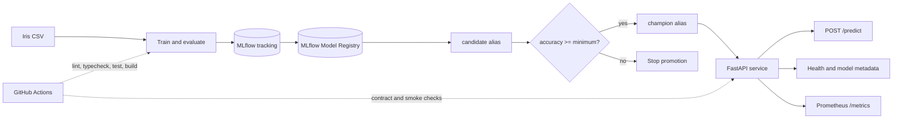

# MLOps Train, Register, Serve

[](https://github.com/aelsaeed/mlops-train-register-serve/actions/workflows/ci.yml)
[](pyproject.toml)
[](LICENSE)

A compact, end-to-end MLOps reference project that trains and evaluates an Iris classifier,
tracks lineage in MLflow 3, registers a candidate, promotes it through a quality gate, and
serves the champion through a typed FastAPI service.

The project is deliberately small enough to run on a laptop while still demonstrating the
engineering controls around a model: reproducibility metadata, registry aliases, automated
promotion, API contracts, health checks, Prometheus metrics, containers, tests, and CI.

## What this demonstrates

- **Experiment lineage:** parameters, dataset and source hashes, key runtime versions, evaluation
  metrics, model signature, input example, and artifacts are recorded in MLflow.
- **Governed delivery:** registry aliases identify the `candidate` and `champion`; promotion
  succeeds only when the candidate meets a configurable minimum accuracy.
- **Typed serving:** batch predictions use named Iris features and return a class, confidence,
  and the configured alias URI.
- **Operational readiness:** separate liveness and readiness checks, model metadata, and valid
  Prometheus exposition are available from the API.
- **Delivery discipline:** an installable Python package, Docker Compose stack, linting, static
  typing, tests, smoke checks, and GitHub Actions keep the workflow repeatable.

## Architecture



MLflow aliases replace deprecated registry stages. Serving always targets
`models:/iris-classifier@champion`, so promotion does not require an application configuration
change. The API resolves and caches the model when it loads; restart or roll out the service after
moving the alias so a running process picks up the new champion.

## Quickstart

Prerequisites: Python 3.11 or 3.12, `make`, and `curl`. Docker is optional for the default
local workflow.

```bash
git clone https://github.com/aelsaeed/mlops-train-register-serve.git
cd mlops-train-register-serve

python3 -m venv .venv
source .venv/bin/activate
make setup
make demo
```

`make setup` installs the project and development tools in editable mode using the tested versions
in `constraints.txt`. `make demo` runs the local train -> register -> promote -> serve -> predict
path and writes inspectable metadata under `artifacts/demo/`.

When the demo completes, inspect the response captured by its smoke test:

```bash
python -m json.tool artifacts/demo/predict_response.json
```

To send the same typed batch request interactively, start the persisted champion with
`make serve` and then run:

```bash
curl --fail --request POST http://localhost:8000/predict \
  --header 'Content-Type: application/json' \
  --data '{
    "instances": [
      {
        "sepal_length": 5.1,
        "sepal_width": 3.5,
        "petal_length": 1.4,
        "petal_width": 0.2
      }
    ]
  }'
```

Expected response shape:

```json
{
  "predictions": [
    {
      "class_id": 0,
      "class_name": "setosa",
      "confidence": 0.91
    }
  ],
  "model_uri": "models:/iris-classifier@champion",
  "count": 1
}
```

The class and confidence are illustrative; they depend on the promoted model and input. The
response never relies on a hard-coded run ID.

## Run the lifecycle step by step

Start the MLflow tracking server and open <http://localhost:5000>:

```bash
make mlflow
```

In another terminal with the virtual environment active:

```bash
export MLFLOW_TRACKING_URI=http://localhost:5000
make train
make register
make promote
make serve
```

The steps have distinct responsibilities:

| Command | Responsibility | Primary evidence |
| --- | --- | --- |
| `make train` | Train and evaluate a deterministic candidate | Run parameters, SHA-256 dataset hash, signature, input example, metrics, and confusion matrix |
| `make register` | Register the run recorded by `make train` | Immutable MLflow model version with the `candidate` alias |
| `make promote` | Apply the minimum-accuracy gate | `champion` moves only when the gate passes |
| `make serve` | Load the champion and start FastAPI | Typed OpenAPI contract, readiness state, predictions, and service metrics |

Override the promotion threshold when evaluating policy behavior:

```bash
MINIMUM_ACCURACY=0.90 make promote
```

The promotion CLI also accepts `--minimum-accuracy`. A failed gate leaves the existing
`champion` unchanged and exits without silently deploying the candidate.

The editable install also exposes `mlops-train`, `mlops-register`, `mlops-promote`, and
`mlops-serve`; run any command with `--help` for its full interface.

## Docker Compose

The Compose stack builds the API image and runs both MLflow and the serving service:

```bash
docker compose up --build
```

On a legacy Compose installation, use `docker-compose` in place of `docker compose`; the Makefile
and lifecycle scripts detect either form automatically.

Useful local URLs:

- MLflow UI: <http://localhost:5000>
- FastAPI documentation: <http://localhost:8000/docs>
- Readiness: <http://localhost:8000/health/ready>
- Metrics: <http://localhost:8000/metrics>

Both published ports bind to `127.0.0.1`. Compose runs the API as a non-root user with a read-only
filesystem, and MLflow metadata and artifacts use named volumes. The API becomes ready only after
it can load the configured champion.

To exercise training and promotion against the containerized MLflow service, use:

```bash
bash scripts/demo.sh --full
```

Stop the stack without deleting its persisted data:

```bash
docker compose down
```

## Serving contract

| Method and path | Purpose |
| --- | --- |
| `GET /health/live` | Confirms that the API process is running |
| `GET /health/ready` | Confirms that the configured model can be loaded |
| `GET /model` | Reports the model URI, load state, and expected feature names |
| `POST /predict` | Scores one or more typed Iris observations |
| `GET /metrics` | Exposes request, error, and latency metrics in Prometheus text format |
| `GET /docs` | Presents the generated OpenAPI interface |

Example model metadata:

```json
{
  "model_uri": "models:/iris-classifier@champion",
  "loaded": true,
  "feature_names": [
    "sepal_length",
    "sepal_width",
    "petal_length",
    "petal_width"
  ]
}
```

## Evaluation evidence

Each training run records the following evidence instead of relying on a score copied into this
README:

| Evidence | Why it matters |
| --- | --- |
| Accuracy | Simple promotion policy input for the balanced demonstration dataset |
| Macro precision, recall, and F1 | Per-class performance summarized without favoring one class |
| Confusion matrix | Makes class-specific errors visible |
| Dataset SHA-256 | Connects a result to the canonicalized feature and target content |
| Source SHA-256 and key runtime versions | Prevent source or tracked runtime changes from reusing a model fingerprint |
| Model signature and input example | Makes the serving contract explicit and testable |
| Seed and model parameters | Supports repeatable comparisons between runs |

Inspect the current run and model-version values in MLflow rather than treating any example
number as a durable benchmark. See [MODEL_CARD.md](MODEL_CARD.md) for intended use, data details,
and limitations.

## Quality checks and CI

Run the same core checks before opening a pull request:

```bash
make check
make test
make demo
make build
```

`make check` covers formatting, Ruff, mypy, and the coverage threshold. GitHub Actions additionally
tests Python 3.11 and 3.12, runs a tiny packaged training command, builds the wheel and source
distribution, audits dependencies, and exercises the non-root API image through a containerized
train -> register -> promote -> readiness -> predict lifecycle. See
[CONTRIBUTING.md](CONTRIBUTING.md) for the development workflow and the documented audit
exception.

## Repository map

```text
.
├── app/                    # Compatibility shim for uvicorn app.main:app
├── data/sample.csv         # Tiny deterministic Iris lifecycle fixture
├── scripts/                # Register, promote, demo, and smoke-test entry points
├── src/mlops_trs/          # Training, registry, CLI, and FastAPI implementation
├── tests/                  # Unit, registry, promotion, and API contract tests
├── Dockerfile              # Version-constrained, non-root API image
├── constraints.txt         # Dependency versions exercised by local setup and CI
├── docker-compose.yml      # Local MLflow and API stack
├── pyproject.toml          # Package metadata, dependencies, and tool configuration
├── MODEL_CARD.md           # Model scope, evaluation, risks, and limitations
└── Makefile                # Short, discoverable development commands
```

## Design choices and limitations

- **MLOps mechanics over model novelty.** Iris and the small checked-in fixture keep feedback
  fast. They are not evidence that the model generalizes to real botanical measurements.
- **A transparent gate over a complete approval system.** Minimum accuracy demonstrates an
  automated control, but production approval should also consider class-level metrics, data
  quality, calibration, review, and rollback policy.
- **Local infrastructure over production scale.** SQLite, local artifacts, and Docker Compose
  optimize for evaluation on one machine. The project does not include a remote database,
  object storage, authentication, high availability, or autoscaling.
- **Observable endpoint over a monitoring platform.** The API exports Prometheus metrics, but
  dashboards, durable collection, alerting, drift detection, and incident response are future
  work.
- **Model probability over calibrated confidence.** The returned confidence is useful for
  demonstration and debugging; it is not guaranteed to be calibrated.
- **Stable process state over hot reload.** A serving process caches the loaded champion. Moving
  the alias avoids a configuration edit, but the process still needs a restart or rollout to load
  the new model version.
- **Temporary dependency exception.** CI narrowly ignores `PYSEC-2026-3552` in transitive
  `cryptography` 49.0.0 because MLflow 3.15.1 currently requires `cryptography<50`. New findings
  still fail the audit; remove the exception when MLflow permits the fixed 50.0.0 release.

The [roadmap](ROADMAP.md) separates these deliberate limits from the next engineering steps.

## Documentation

- [Model card](MODEL_CARD.md)
- [Roadmap](ROADMAP.md)
- [Contributing guide](CONTRIBUTING.md)
- [Changelog](CHANGELOG.md)
- [MIT license](LICENSE)

## Troubleshooting

- **`make demo` cannot import the package:** activate `.venv` and rerun `make setup`.
- **Readiness returns a failure:** train, register, and promote a model so the `champion` alias
  exists, then verify `MLFLOW_TRACKING_URI`.
- **Promotion is rejected:** inspect the candidate metrics in MLflow and the configured
  `MINIMUM_ACCURACY`; do not lower the gate without an explicit reason.
- **API port `8000` is busy:** run `API_PORT=8080 make demo` or
  `API_PORT=8080 make serve`, then use port `8080` in requests.
- **Docker is unavailable:** use the default Docker-free `make demo` path.
